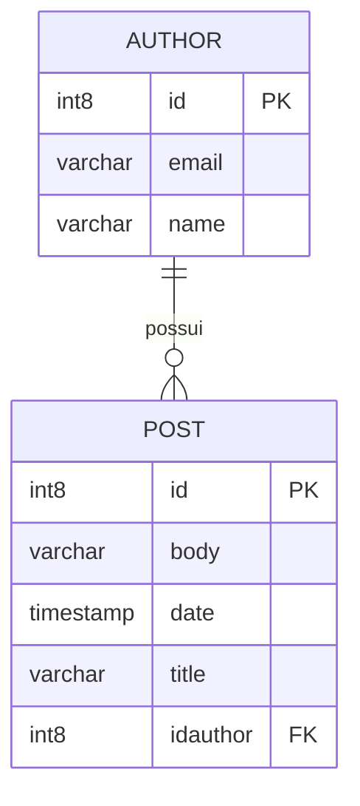

# Estrutura Inicial do Banco de Dados

## Descrição Geral

Esta migração (V01) define a estrutura inicial do banco de dados, criando as tabelas fundamentais para um sistema de gerenciamento de publicações (posts) associadas a autores. Trata-se exclusivamente de uma **estrutura de dados**, sem lógica de negócio envolvida.

---

## Estruturas de Dados

### Tabela: `author`

Armazena as informações dos autores que podem criar publicações no sistema.

| Coluna  | Tipo           | Restrições                          | Descrição                        |
|---------|----------------|-------------------------------------|----------------------------------|
| `id`    | `int8` (bigint)| Chave primária, gerada automaticamente | Identificador único do autor    |
| `email` | `varchar(255)` | —                                   | Endereço de e-mail do autor      |
| `name`  | `varchar(255)` | —                                   | Nome do autor                    |

---

### Tabela: `post`

Armazena as publicações criadas pelos autores.

| Coluna      | Tipo           | Restrições                          | Descrição                              |
|-------------|----------------|-------------------------------------|----------------------------------------|
| `id`        | `int8` (bigint)| Chave primária, gerada automaticamente | Identificador único da publicação     |
| `body`      | `varchar(255)` | —                                   | Conteúdo/corpo da publicação           |
| `date`      | `timestamp`    | —                                   | Data e hora da publicação              |
| `title`     | `varchar(255)` | —                                   | Título da publicação                   |
| `idauthor`  | `int8` (bigint)| Chave estrangeira → `author(id)`    | Referência ao autor da publicação      |

---

## Relacionamentos

| Origem          | Destino        | Tipo          | Constraint                              |
|-----------------|----------------|---------------|-----------------------------------------|
| `post.idauthor` | `author.id`    | Muitos para Um | `FKihfu7cdj7hk21tah8sox7lnff`          |

Um **autor** pode possuir diversas **publicações**, enquanto cada **publicação** pertence a exatamente um **autor**.

---

## Diagrama Entidade-Relacionamento

---

## Insights

- As colunas `email`, `name`, `body` e `title` não possuem restrições de obrigatoriedade (`NOT NULL`) nem de unicidade, o que permite registros duplicados e campos vazios. Recomenda-se avaliar a adição de `NOT NULL` em campos essenciais como `email` e `name` do autor, e `title` da publicação.
- O campo `email` da tabela `author` não possui constraint `UNIQUE`, permitindo que múltiplos autores sejam cadastrados com o mesmo endereço de e-mail.
- O campo `body` da tabela `post` está limitado a 255 caracteres, o que pode ser insuficiente para conteúdos mais extensos. Considerar o uso de `TEXT` caso publicações maiores sejam esperadas.
- A chave estrangeira não define comportamento de cascata (`ON DELETE`, `ON UPDATE`), o que significa que a exclusão de um autor será bloqueada caso existam publicações vinculadas a ele.
- A estratégia de geração de identidade utilizada é `GENERATED BY DEFAULT AS IDENTITY`, que permite a inserção manual de valores para o `id`, diferentemente de `GENERATED ALWAYS`, que impediria essa prática. Isso pode ser relevante em cenários de migração de dados.
