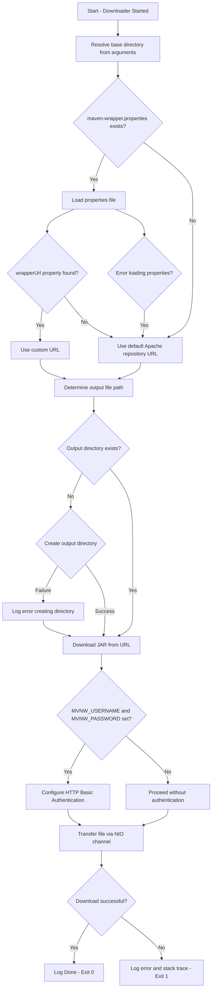

# MavenWrapperDownloader

## Overview

The **MavenWrapperDownloader** is a utility program responsible for automatically downloading the Maven Wrapper JAR file (`maven-wrapper.jar`). The Maven Wrapper allows projects to build with a specific version of Apache Maven without requiring developers to manually install it. This downloader ensures the necessary wrapper JAR is available locally before a Maven build begins.

## Key Configuration

| Parameter | Value / Default | Description |
|---|---|---|
| Wrapper Version | `0.5.6` | The version of the Maven Wrapper being downloaded |
| Default Download URL | Apache Maven Repository (`repo.maven.apache.org`) | Fallback URL used when no custom URL is configured |
| Properties File Path | `.mvn/wrapper/maven-wrapper.properties` | Configuration file that may specify a custom download URL |
| JAR Output Path | `.mvn/wrapper/maven-wrapper.jar` | Local destination where the downloaded JAR is saved |
| Custom URL Property | `wrapperUrl` | Property name in the configuration file to override the default download URL |

## Authentication Support

The downloader supports authenticated downloads via environment variables:

| Environment Variable | Purpose |
|---|---|
| `MVNW_USERNAME` | Username for authenticated access to the download repository |
| `MVNW_PASSWORD` | Password for authenticated access to the download repository |

Both variables must be set for authentication to be applied. When present, the downloader uses HTTP Basic Authentication to retrieve the JAR file.

## Functional Description

1. **Initialization** — The program receives a base directory as a command-line argument and uses it as the root for all relative paths.
2. **Configuration Loading** — If a `maven-wrapper.properties` file exists, it is read to check for a custom download URL (`wrapperUrl`). If the property is absent or the file does not exist, the default Apache repository URL is used.
3. **Directory Preparation** — The output directory (`.mvn/wrapper/`) is created if it does not already exist.
4. **Download Execution** — The JAR file is downloaded from the resolved URL using Java NIO channels for efficient file transfer.
5. **Exit Status** — The program exits with code `0` on success or `1` on failure.

## Insights

- This utility is typically invoked automatically by the Maven Wrapper shell scripts (`mvnw` / `mvnw.cmd`) and is not intended to be run manually by end users.
- The use of environment variables for credentials allows secure integration with CI/CD pipelines without hardcoding sensitive information.
- If the properties file cannot be read due to an I/O error, the program gracefully falls back to the default download URL rather than failing.
- The program uses Java NIO (`FileChannel.transferFrom`) for the download, which is more efficient than traditional stream-based copying for large files.

## Process Flow

## Licensing

This program is distributed under the **Apache License, Version 2.0**.
