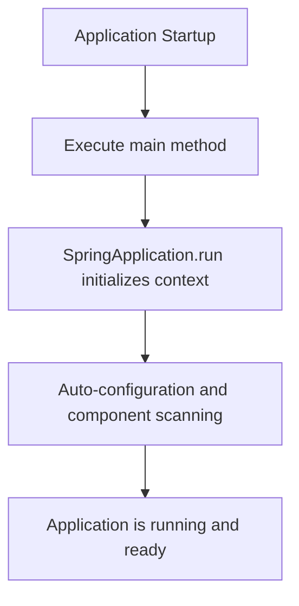

# DemoApplication

## Overview

This is the entry point of a **Spring Boot** application designed for a **PostgreSQL Multi-Tenancy** system. It serves as the bootstrap class that initializes and launches the entire application context.

## Application Details

| Attribute          | Value                                          |
|--------------------|-------------------------------------------------|
| **Application Name** | DemoApplication                              |
| **Package**          | `br.com.fullcustom.postgresmultitenancy`     |
| **Framework**        | Spring Boot                                  |
| **Purpose**          | Multi-tenancy support with PostgreSQL        |

## Key Components

| Component                  | Description                                                                 |
|----------------------------|-----------------------------------------------------------------------------|
| `@SpringBootApplication`  | Enables auto-configuration, component scanning, and Spring Boot setup.      |
| `main` method              | Standard Java entry point that delegates to Spring Boot's application runner.|

## Process Flow

## Insights

- The application belongs to the **fullcustom** organization and is built to address **multi-tenancy** scenarios using **PostgreSQL** as the underlying database.
- Multi-tenancy implies the system is designed to serve **multiple clients (tenants)** from a single application instance, with data isolation handled at the database level.
- As this is the bootstrap class, the actual multi-tenancy logic, tenant resolution strategies, and data source routing are expected to be implemented in other components within the same package hierarchy.
- The naming convention and package structure suggest this may be a **demonstration or proof-of-concept** project for showcasing PostgreSQL-based multi-tenancy capabilities.
