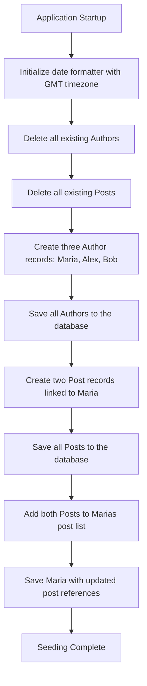

# Instantiation - Database Seed Configuration

## Overview

This configuration component is responsible for populating the application database with initial sample data upon startup. It seeds the system with a predefined set of **Authors** and **Posts**, establishing the foundational data required for the multi-tenancy PostgreSQL-based application to function during development or testing.

## Dependencies

| Dependency | Type | Purpose |
|---|---|---|
| `AuthorRepository` | Repository | Manages persistence operations for Author entities |
| `PostRepository` | Repository | Manages persistence operations for Post entities |

## Seed Data

### Authors

| Name | Email |
|---|---|
| Maria Brown | maria@gmail.com |
| Alex Green | alex@gmail.com |
| Bob Grey | bob@gmail.com |

### Posts

| Date | Title | Content | Author |
|---|---|---|---|
| 21/03/2018 | Off on a trip | Im traveling to São Paulo. Cheers! | Maria Brown |
| 23/03/2018 | Good morning | I woke up happy today! | Maria Brown |

## Business Rules

- All existing **Authors** and **Posts** are removed before seeding, ensuring a clean and consistent starting state each time the application launches.
- Dates are parsed using the **GMT** timezone and the `dd/MM/yyyy` format.
- Posts are associated with their respective author both at the Post level (author reference) and at the Author level (embedded post list), maintaining bidirectional consistency.
- Only **Maria Brown** has posts assigned; the other two authors are created without any associated content.

## Process Flow

## Insights

- This class implements `CommandLineRunner`, meaning the seeding logic executes automatically every time the application starts. This behavior is typically appropriate for **development and testing environments** but should be disabled or removed in production to prevent data loss.
- The `deleteAll` operations at the beginning make this a **destructive** initialization — any data previously stored for Authors and Posts will be permanently erased on each restart.
- Only one of the three authors (Maria Brown) is associated with posts, which may indicate this seed data is designed to test scenarios involving both authors with and without content.
- The bidirectional relationship update (saving posts to the repository and then also adding them to Maria's post list before saving Maria again) suggests the data model uses an **embedded or document-reference pattern**, common in NoSQL-influenced designs even when backed by PostgreSQL.
- The date format `dd/MM/yyyy` follows a non-US convention, consistent with Brazilian locale standards, aligning with the package namespace (`br.com.fullcustom`).
