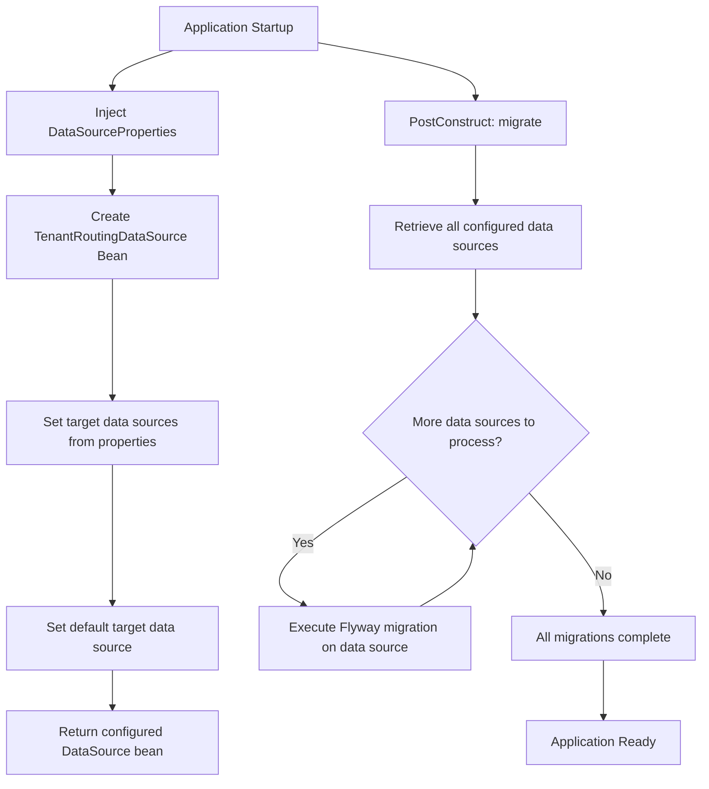

# DataSource Configuration

## Overview

This document describes a multi-tenant database configuration component responsible for setting up dynamic data source routing and automated database migration. It enables the application to connect to multiple PostgreSQL databases (tenants) through a single unified data source, while ensuring all tenant databases are kept up-to-date with schema migrations.

## Purpose

The configuration serves two primary functions:

1. **Multi-Tenant Data Source Routing** – Configures a routing mechanism that directs database operations to the appropriate tenant database based on runtime context.
2. **Automated Database Migration** – Ensures all configured tenant databases have their schemas migrated to the latest version upon application startup.

## Key Components

| Component | Responsibility |
|-----------|---------------|
| `DataSourceProperties` | Provides the map of all configured tenant data sources |
| `TenantRoutingDataSource` | Routes database requests to the correct tenant data source at runtime |
| `Flyway` | Handles schema versioning and migration for each tenant database |

## Configuration Behavior

### Data Source Setup

The system retrieves all tenant data sources from the configuration properties and registers them with a routing data source. A **default** tenant data source is designated to handle requests when no specific tenant context is identified.

### Migration Strategy

Upon application initialization, the system iterates through **every** configured tenant data source and executes Flyway migrations against each one. This guarantees that all tenant databases are structurally consistent and up-to-date before the application begins serving requests.

## Process Flow

## Insights

- The multi-tenant approach uses a **routing data source pattern**, meaning tenant resolution happens transparently at the data source level rather than requiring application code changes.
- Flyway migrations run synchronously at startup via `@PostConstruct`, which means the application will not be available until all tenant databases are successfully migrated.
- If any single tenant migration fails, it could prevent the entire application from starting, creating a potential availability risk in environments with many tenants.
- The default data source acts as a fallback, ensuring the system does not fail when tenant context is unavailable.
- This design assumes all tenants share the same schema structure, as the same Flyway migration scripts are applied uniformly across all data sources.
