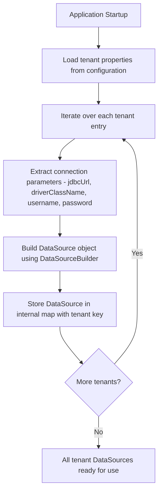

# DataSourceProperties Configuration

## Overview

This component is responsible for managing and configuring multiple database connections (multi-tenancy) within the application. It allows the system to dynamically create and maintain separate database connections for different tenants, enabling data isolation between them.

## Purpose

In a multi-tenant architecture, each tenant (e.g., a client organization) requires its own dedicated database connection. This configuration class reads tenant-specific database connection details from the application properties and converts them into usable data source objects at runtime.

## Configuration Structure

The class is bound to properties prefixed with `tenants` in the application configuration file. Each tenant entry contains the following connection parameters:

| Parameter         | Description                                      |
|-------------------|--------------------------------------------------|
| `jdbcUrl`         | The JDBC connection URL for the tenant database  |
| `driverClassName` | The database driver class to be used             |
| `username`        | The database authentication username             |
| `password`        | The database authentication password             |

## Key Responsibilities

| Responsibility                  | Description                                                                 |
|---------------------------------|-----------------------------------------------------------------------------|
| Tenant Registration             | Accepts a map of tenant identifiers and their respective connection details |
| DataSource Creation             | Converts raw connection properties into fully configured database connections |
| Centralized Connection Storage  | Maintains all tenant data sources in a single ordered collection            |

## Process Flow

## Insights

- The use of `LinkedHashMap` ensures that tenant data sources maintain their insertion order, which can be important for predictable iteration and debugging.
- Each tenant's database connection is created independently, meaning one tenant's misconfigured connection will not prevent other tenants from being initialized.
- A log message is printed to the console during each data source creation, providing visibility into which tenant connections are being established at startup.
- This component is a foundational piece of a **PostgreSQL multi-tenancy** strategy, where tenant isolation is achieved at the database connection level rather than through schema or row-level separation.
- The configuration-driven approach allows new tenants to be onboarded simply by adding their connection details to the application properties file, without requiring code changes.
