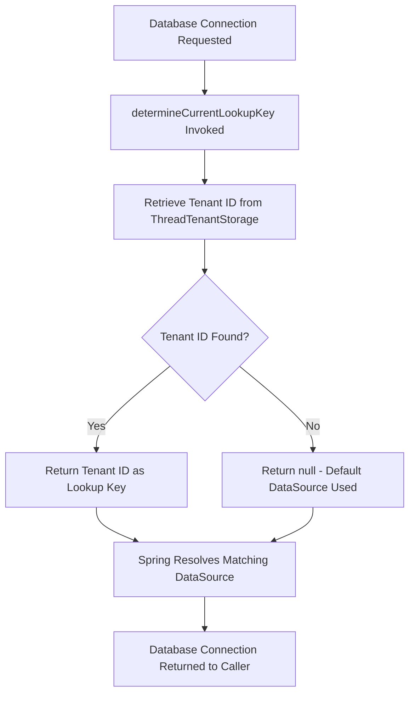

# TenantRoutingDataSource

## Overview

This component is responsible for dynamically routing database connections to the correct tenant-specific data source in a **multi-tenancy** architecture. It ensures that each incoming request is directed to the appropriate database (or schema) based on the currently identified tenant, enabling data isolation between different tenants sharing the same application instance.

## Key Concepts

| Concept | Description |
|---|---|
| **Multi-Tenancy** | An architecture where a single application instance serves multiple tenants (clients/organizations), each with isolated data. |
| **Tenant Routing** | The mechanism that determines which database or schema to connect to, based on the tenant associated with the current request. |
| **Thread-Based Tenant Resolution** | The current tenant identifier is stored per request thread, ensuring concurrent requests from different tenants are routed correctly. |

## How It Works

1. A web request arrives and the tenant is identified (typically from a request header, subdomain, or token).
2. The tenant identifier is stored in a thread-local context (`ThreadTenantStorage`).
3. When the application needs a database connection, this routing data source intercepts the call.
4. It retrieves the tenant identifier from the thread-local storage.
5. The appropriate tenant-specific data source is selected and the connection is returned.

## Dependencies

| Dependency | Purpose |
|---|---|
| `AbstractRoutingDataSource` (Spring Framework) | Provides the base infrastructure for routing between multiple data sources based on a lookup key. |
| `ThreadTenantStorage` | Holds the current tenant identifier on a per-thread basis, making it accessible throughout the request lifecycle. |

## Process Flow

## Insights

- This class is a central piece of the **multi-tenant data isolation strategy**. If the tenant identifier is not correctly set in `ThreadTenantStorage` before a database operation occurs, requests may be routed to the wrong data source or fail entirely.
- The routing mechanism is transparent to the rest of the application — services and repositories interact with the database without needing to be aware of tenant-specific connection logic.
- A diagnostic log message is printed each time the lookup key is resolved, which is useful during development but should be replaced with a proper logging framework (e.g., SLF4J) for production environments to avoid performance overhead and enable log-level control.
- The data source map (mapping tenant IDs to actual data sources) must be configured externally and provided to this routing data source at initialization time for the routing to function correctly.
