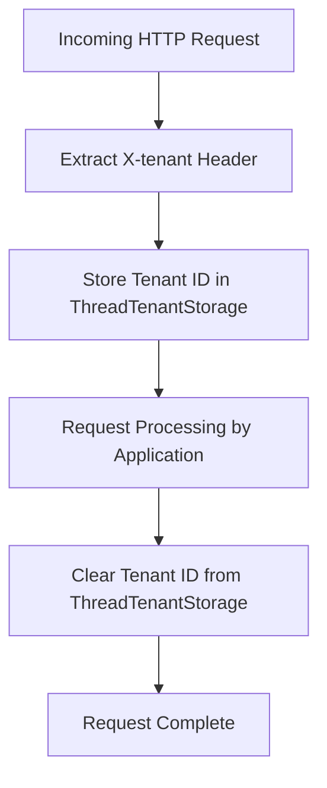

# HeaderTenantInterceptor

## Overview

This component is a **web request interceptor** responsible for managing multi-tenancy in a PostgreSQL-based multi-tenant application. It extracts the tenant identifier from an incoming HTTP request header and ensures that each request is routed to the correct tenant context throughout its lifecycle.

Multi-tenancy allows a single application instance to serve multiple clients (tenants), with each tenant's data being logically isolated. This interceptor is the entry point that determines **which tenant** a given request belongs to.

## Key Concepts

| Concept | Description |
|---|---|
| **Tenant** | A distinct client or organization sharing the same application instance |
| **X-tenant Header** | A custom HTTP header that must be included in every request to identify the tenant |
| **Thread-local Storage** | A mechanism to store the tenant identifier for the duration of a single request thread |

## How It Works

1. **Before processing a request**: The interceptor reads the `X-tenant` header from the incoming HTTP request and stores the tenant identifier in a thread-local variable (`ThreadTenantStorage`). This ensures that all downstream operations (e.g., database queries) are scoped to the correct tenant.

2. **After processing a request**: Once the request has been handled, the stored tenant identifier is cleared from thread-local storage to prevent data leakage between requests.

3. **After completion**: No additional action is taken after the full request lifecycle completes.

## Configuration Details

| Property | Value | Description |
|---|---|---|
| **Header Name** | `X-tenant` | The HTTP header key expected in every incoming request |
| **Storage Mechanism** | `ThreadTenantStorage` | Thread-local store that holds the tenant ID for the current request |

## Process Flow

## Insights

- **Every API request must include the `X-tenant` header**; without it, the tenant identifier will be null, which could lead to routing errors or failed database connections.
- The use of thread-local storage ensures tenant isolation at the request level, meaning concurrent requests from different tenants are handled independently and safely.
- Clearing the tenant context in the post-handle phase is critical to avoid **tenant data leakage** — a scenario where one tenant's request inadvertently accesses another tenant's data due to a stale thread-local value.
- This interceptor is registered as a Spring **Component**, meaning it is auto-detected during application startup, but it must also be registered in the web configuration (e.g., via `WebMvcConfigurer`) to be active in the request pipeline.
- The interceptor logs each interception to the console, which is useful for debugging but should be replaced with a proper logging framework (e.g., SLF4J) in production environments.
