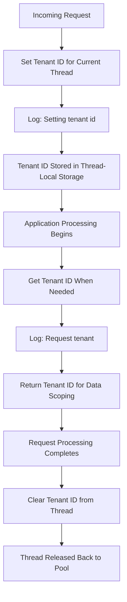

# ThreadTenantStorage

## Overview

This component is responsible for managing tenant identification in a multi-tenancy architecture. It ensures that each user request is associated with the correct tenant (client/organization) throughout its processing lifecycle. This is a critical piece of infrastructure that enables a single application instance to serve multiple isolated tenants using a shared PostgreSQL database.

## Purpose

In a multi-tenant system, multiple organizations share the same application. This storage mechanism keeps track of **which tenant** is being served on each individual request thread, ensuring that data access and operations are scoped to the correct organization at all times.

## Key Concepts

| Concept | Description |
|---|---|
| **Tenant** | Represents a distinct client or organization using the system |
| **Thread-Local Storage** | A mechanism that isolates data per processing thread, preventing tenant information from leaking between concurrent requests |
| **Multi-Tenancy** | An architecture where a single application serves multiple tenants with logical data separation |

## Operations

| Operation | Description |
|---|---|
| **Set Tenant** | Stores the tenant identifier for the current request being processed |
| **Get Tenant** | Retrieves the tenant identifier associated with the current request |
| **Clear Tenant** | Removes the tenant identifier after the request is completed, preventing data leakage between requests |

## Process Flow

## Insights

- **Data Isolation Guarantee**: By using thread-local storage, the system guarantees that concurrent requests from different tenants will never accidentally access each other's data, even when processed simultaneously.
- **Request Lifecycle Management**: The clear operation is essential — failing to remove the tenant identifier after a request could cause a subsequent request on the same thread to inherit the wrong tenant context, leading to serious data security issues.
- **Diagnostic Logging**: The component logs tenant identification during both storage and retrieval operations, which supports troubleshooting and auditing of tenant-specific request routing.
- **Shared Database Strategy**: This component is part of a PostgreSQL multi-tenancy configuration, indicating the system uses a single database with tenant-based data partitioning rather than separate databases per tenant.
- **Stateless Design**: The storage is entirely static and thread-bound, meaning it does not introduce any shared mutable state, which is important for application scalability and thread safety.
