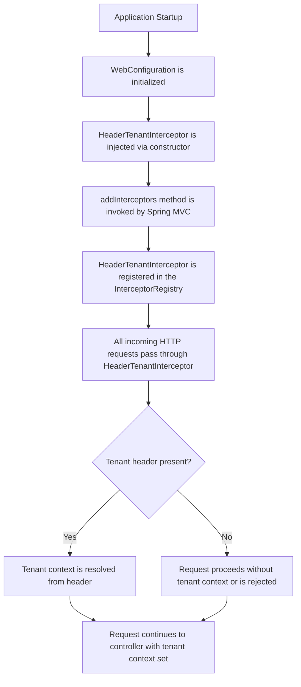

# WebConfiguration

## Overview

This configuration class is responsible for setting up web-level request interception within a multi-tenancy architecture. It ensures that every incoming HTTP request is processed by a tenant identification interceptor, enabling the system to determine which tenant (client/organization) the request belongs to before it reaches the application's business logic.

## Purpose

In a multi-tenant system backed by PostgreSQL, it is essential to identify the tenant context for each request. This configuration registers a **Header Tenant Interceptor** that inspects incoming request headers to resolve the appropriate tenant, ensuring data isolation and correct routing across tenants.

## Key Components

| Component | Type | Description |
|---|---|---|
| `WebConfiguration` | Spring Configuration | Registers web interceptors for the application |
| `HeaderTenantInterceptor` | Dependency (Injected) | Intercepts HTTP requests to extract tenant identification from request headers |

## How It Works

- The application injects the `HeaderTenantInterceptor` at startup.
- The interceptor is registered globally, meaning it applies to **all incoming web requests**.
- For each request, the interceptor reads tenant information from the HTTP headers, allowing downstream components to operate within the correct tenant context.

## Insights

- This class is part of a **PostgreSQL-based multi-tenancy** solution, where tenant resolution happens at the HTTP layer via request headers.
- Since the interceptor is registered without any path pattern restrictions, it applies universally to all endpoints — there are no exclusions configured.
- The use of `WebRequestInterceptor` (via `addWebRequestInterceptor`) rather than a `HandlerInterceptor` indicates that the interceptor operates at the web request level, which is suitable for cross-cutting concerns like tenant resolution.
- The tenant interceptor is injected through constructor injection, following Spring best practices for mandatory dependencies and promoting testability.

## Process Flow

