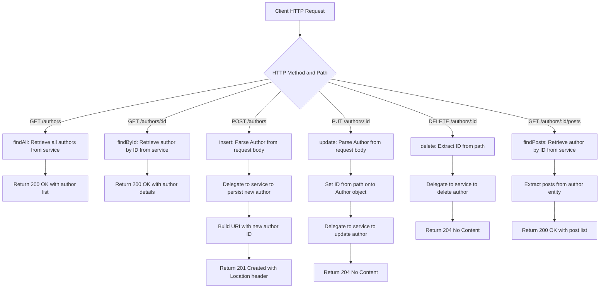

# AuthorResource - REST API Controller

## Overview

This component serves as the REST API layer for managing **Authors** within a multi-tenancy application backed by PostgreSQL. It exposes a set of HTTP endpoints that allow consumers to perform full CRUD (Create, Read, Update, Delete) operations on Author records, as well as retrieve posts associated with a specific author.

The base URL for all endpoints is `/authors`.

## API Endpoints

| HTTP Method | Endpoint | Description | Request Body | Response |
|-------------|----------|-------------|--------------|----------|
| **GET** | `/authors` | Retrieves all authors | — | `200 OK` with list of authors |
| **GET** | `/authors/{id}` | Retrieves a specific author by ID | — | `200 OK` with author details |
| **POST** | `/authors` | Creates a new author | Author object | `201 Created` with location URI |
| **PUT** | `/authors/{id}` | Updates an existing author | Author object | `204 No Content` |
| **DELETE** | `/authors/{id}` | Deletes an author by ID | — | `204 No Content` |
| **GET** | `/authors/{id}/posts` | Retrieves all posts belonging to a specific author | — | `200 OK` with list of posts |

## Dependencies

| Dependency | Type | Purpose |
|------------|------|---------|
| `AuthorService` | Service Layer | Handles all business logic and data access operations for authors |

## Domain Entities Involved

| Entity | Role |
|--------|------|
| **Author** | Primary resource managed by this controller |
| **Post** | Related resource — an author can have multiple posts |

## Key Behaviors

- **Resource Creation**: When a new author is created, the response includes a `Location` header pointing to the newly created resource URI (e.g., `/authors/5`).
- **Author-Post Relationship**: The `/authors/{id}/posts` endpoint leverages the relationship between Author and Post entities, allowing retrieval of all posts authored by a given individual without requiring a separate Post-specific endpoint.
- **Multi-Tenancy Context**: This controller operates within a PostgreSQL multi-tenancy architecture, meaning the data served is tenant-scoped based on the application's tenancy resolution strategy.

## Process Flow

## Insights

- The controller follows a clean **delegation pattern**, keeping itself free of business logic and relying entirely on `AuthorService` for data operations.
- The `findPosts` endpoint first loads the full Author entity and then accesses its posts, which implies a **lazy or eager loading** relationship between Author and Post at the persistence layer. This could have performance implications if the post collection is large.
- The `update` method explicitly sets the path variable ID onto the request body object before delegating to the service, ensuring consistency between the URL identifier and the entity being persisted.
- Standard Spring REST conventions are followed throughout, including proper use of HTTP status codes (`200`, `201`, `204`) and response entity construction.
