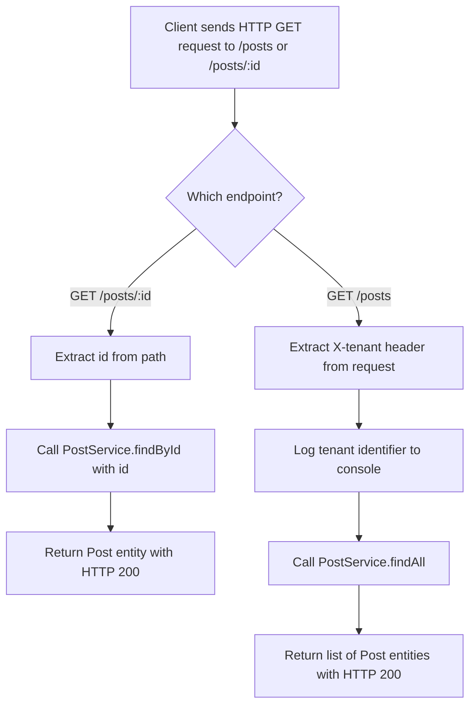

# PostResource - REST API Controller

## Overview

This document describes the **PostResource** REST API controller, which serves as the entry point for handling HTTP requests related to **Post** entities within a multi-tenant application. The system supports multiple tenants (clients/organizations) sharing the same application infrastructure, distinguished by a tenant identifier passed in the request header.

## API Endpoint Summary

The base path for all endpoints in this resource is `/posts`.

| HTTP Method | Endpoint | Description | Parameters |
|-------------|----------|-------------|------------|
| **GET** | `/posts/{id}` | Retrieves a single post by its unique identifier | `id` (path parameter) — The numeric identifier of the post |
| **GET** | `/posts` | Retrieves all posts for a given tenant | `X-tenant` (request header) — The tenant identifier |

## Endpoint Details

### Find Post by ID

- **Path:** `/posts/{id}`
- **Method:** GET
- **Input:** A numeric post identifier provided in the URL path.
- **Output:** Returns the corresponding Post object with an HTTP 200 (OK) status.

### Find All Posts

- **Path:** `/posts`
- **Method:** GET
- **Input:** Requires a custom HTTP header `X-tenant` to identify which tenant's data should be retrieved.
- **Output:** Returns a list of all Post objects associated with the resolved tenant, with an HTTP 200 (OK) status.

## Multi-Tenancy Model

The application implements a **multi-tenant architecture** using PostgreSQL. Tenant isolation is achieved by passing the tenant identifier (`X-tenant`) as a request header. This design allows multiple organizations or clients to use the same deployed application while keeping their data logically separated.

## Dependencies

| Component | Role |
|-----------|------|
| **PostService** | Business service layer responsible for post retrieval logic |
| **Post** | Domain entity representing a post |

## Process Flow

## Insights

- The `findAll` endpoint explicitly logs the tenant identifier to the console, which is useful for debugging and tracing in a multi-tenant environment but may need to be replaced with a proper logging framework for production use.
- The `findById` endpoint does not explicitly require the `X-tenant` header, which suggests that tenant resolution for single-record lookups may be handled at a different layer (e.g., a request filter or interceptor that sets the tenant context globally per request).
- There are no create, update, or delete operations exposed — this resource is **read-only**, indicating it is either in early development or intentionally designed for data consumption purposes only.
- The controller delegates all business logic to the **PostService** layer, maintaining a clean separation of concerns between the API layer and the service layer.
