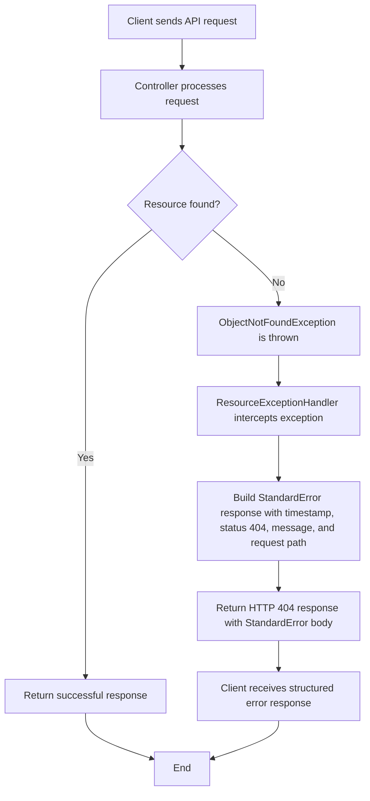

# ResourceExceptionHandler

## Overview

This component serves as a **centralized exception handler** for the application's REST API layer. It intercepts specific exceptions thrown during API request processing and translates them into standardized, client-friendly HTTP error responses. This ensures that when a requested resource (such as a record or entity) is not found, the API consistently returns a well-structured error message with the appropriate HTTP status code.

## Key Responsibilities

| Responsibility | Description |
|---|---|
| Centralized Error Handling | Captures exceptions across all API controllers in a single, unified location rather than handling errors individually in each controller. |
| Standardized Error Response | Transforms technical exceptions into a consistent error response format (`StandardError`) containing timestamp, status code, error type, message, and the requested path. |
| HTTP Status Code Mapping | Maps the `ObjectNotFoundException` to the HTTP **404 Not Found** status, ensuring proper RESTful communication with API consumers. |

## Error Response Structure

When a resource is not found, the API returns a response with the following structure:

| Field | Description | Example |
|---|---|---|
| Timestamp | The time (in milliseconds) when the error occurred | `1698765432100` |
| Status | HTTP status code | `404` |
| Error Label | Human-readable error category | `Not found` |
| Message | Detailed description of what was not found | Provided by the originating exception |
| Path | The API endpoint that was requested | `/api/resource/123` |

## Handled Exceptions

| Exception | HTTP Status | Scenario |
|---|---|---|
| `ObjectNotFoundException` | 404 Not Found | A requested entity or resource does not exist in the system |

## Process Flow

## Insights

- This handler is part of a **multi-tenancy architecture** built on PostgreSQL, meaning the "not found" scenarios may vary depending on the tenant context under which the request is being processed.
- The use of a centralized exception handler promotes **maintainability** — adding new exception types and their corresponding HTTP mappings can be done in this single location without modifying individual controllers.
- The `StandardError` response object provides a **uniform contract** for API consumers (front-end applications, integrations, etc.) to programmatically interpret and display error information.
- Currently, only the `ObjectNotFoundException` is handled. As the application evolves, additional exception handlers (e.g., for validation errors, authorization failures, or data integrity violations) would be expected to be added here.
