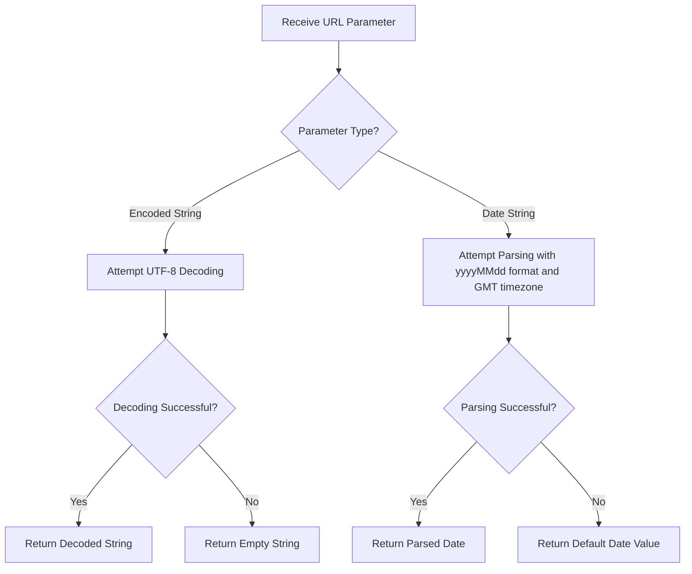

# URL Utility Documentation

## Overview

This document describes a utility component designed to support URL parameter handling within a multi-tenancy PostgreSQL application. It provides common operations for decoding URL-encoded strings and converting date strings from URL parameters into proper date objects.

## Purpose

The utility addresses two common needs when processing incoming HTTP request parameters:

1. **URL Decoding** – Converts URL-encoded text (e.g., `%20` for spaces) back into human-readable strings.
2. **Date Conversion** – Parses date strings received as URL parameters into standardized `Date` objects using a specific format and timezone.

## Component Details

| Attribute         | Value                                                        |
|-------------------|--------------------------------------------------------------|
| **Component Name**| URL                                                          |
| **Type**          | Utility Class                                                |
| **Package**       | `br.com.fullcustom.postgresmultitenancy.resources.util`      |
| **Scope**         | Shared utility for resource/request processing               |

## Methods

| Method              | Input                                      | Output   | Description                                                                                          |
|---------------------|--------------------------------------------|----------|------------------------------------------------------------------------------------------------------|
| `decodeParam`       | Encoded text (`String`)                    | `String` | Decodes a URL-encoded string using UTF-8 encoding. Returns an empty string if decoding fails.        |
| `convertDate`       | Date text (`String`), Default value (`Date`) | `Date`   | Parses a date string in `yyyyMMdd` format using GMT timezone. Returns the default value if parsing fails. |

## Business Rules and Behavior

- **Character Encoding**: All URL parameter decoding strictly uses **UTF-8** encoding to ensure consistent handling of special characters across different systems and locales.
- **Date Format**: Date parameters are expected in the **yyyyMMdd** format (e.g., `20240115` for January 15, 2024). Any deviation from this format will result in the default value being returned.
- **Timezone**: All date parsing is performed in the **GMT** timezone, ensuring consistency regardless of the server's local timezone configuration.
- **Error Resilience**: Both methods are designed to fail gracefully — they never throw exceptions to the caller. Instead, they return safe fallback values (empty string or a provided default date).

## Process Flow

## Insights

- This utility is part of a **multi-tenancy architecture** backed by PostgreSQL, where URL parameters likely play a role in filtering or routing tenant-specific data.
- The use of GMT as a fixed timezone for date parsing prevents inconsistencies that could arise in distributed or cloud-hosted environments where server timezones may vary.
- The `yyyyMMdd` compact date format (without separators) is commonly used in REST API query parameters to avoid URL encoding issues with characters like `/` or `-`.
- The graceful error handling pattern ensures that malformed user input does not cause application-level failures, supporting a more robust API experience.
