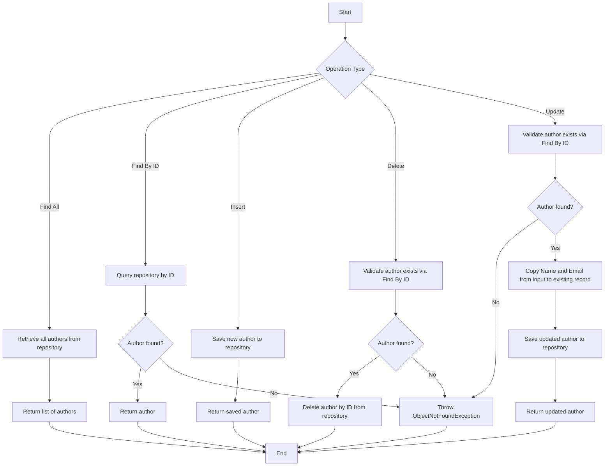

# AuthorService - Documentation

## Overview

The **AuthorService** is a service layer component responsible for managing **Author** entities within a multi-tenancy PostgreSQL application. It provides the core business operations for creating, retrieving, updating, and deleting author records.

## Entity Managed

| Entity   | Description                                      |
|----------|--------------------------------------------------|
| **Author** | Represents an author with attributes such as **Name** and **Email** |

## Dependencies

| Dependency            | Purpose                                              |
|-----------------------|------------------------------------------------------|
| `AuthorRepository`    | Data access layer for performing database operations on Author entities |
| `ObjectNotFoundException` | Custom exception raised when an author cannot be found by the given identifier |

## Business Operations

| Operation   | Description                                                                                          |
|-------------|------------------------------------------------------------------------------------------------------|
| **Find All**    | Retrieves the complete list of all authors available in the current tenant's schema                  |
| **Find By ID**  | Searches for a specific author by their unique identifier. Raises an error if the author does not exist |
| **Insert**      | Creates a new author record in the database                                                         |
| **Delete**      | Removes an author by their unique identifier. Validates existence before deletion                    |
| **Update**      | Updates an existing author's **Name** and **Email**. Validates existence before applying changes     |

## Business Rules

- **Existence Validation**: Before deleting or updating an author, the system verifies that the author exists. If not found, an `ObjectNotFoundException` is thrown with the message *"Object not found"*.
- **Partial Update Strategy**: During an update, only the **Name** and **Email** fields are overwritten. The existing record is fetched first, then selectively modified and persisted, preserving any other attributes that may exist on the entity.
- **Multi-Tenancy Context**: This service operates within a multi-tenancy architecture backed by PostgreSQL, meaning each tenant has isolated author data.

## Process Flow

## Insights

- The **update** operation follows a **read-then-write** pattern, which ensures data integrity by loading the current state before applying changes. However, this approach involves two database interactions per update (one read, one write).
- The **delete** operation performs a lookup before deletion, which guarantees a meaningful error message if the author does not exist, rather than silently failing.
- The service delegates all persistence logic to the repository layer, maintaining a clean separation of concerns.
- Since this application uses a **multi-tenancy architecture with PostgreSQL**, the tenant context resolution likely happens at a layer above or within the repository, making this service tenant-agnostic in its implementation.
