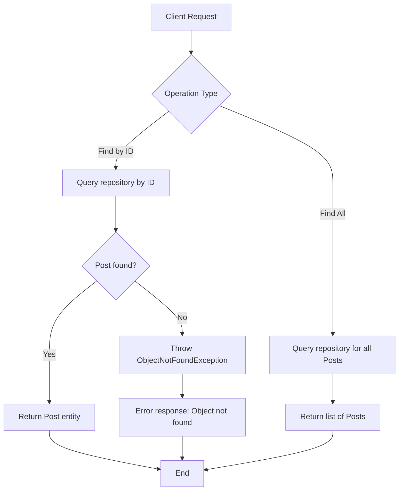

# PostService - Documentation

## Overview

The **PostService** is a service layer component responsible for managing **Post** entities within a multi-tenancy application built on PostgreSQL. It acts as an intermediary between the data access layer (repository) and the application's controllers, providing business operations for retrieving posts.

## Responsibilities

| Responsibility | Description |
|---|---|
| Retrieve a single Post | Finds a specific Post by its unique identifier, raising an error if not found |
| Retrieve all Posts | Returns the complete list of available Posts within the current tenant context |

## Multi-Tenancy Context

This service operates within a **PostgreSQL multi-tenancy** architecture, meaning that data isolation between tenants is handled at the database level. Each tenant's posts are segregated, and the service retrieves only the data belonging to the active tenant.

## Methods

| Method | Input | Output | Description |
|---|---|---|---|
| `findById` | Numeric identifier (`Long`) | A single `Post` entity | Looks up a Post by its ID. If no matching record exists, an **ObjectNotFoundException** is raised. |
| `findAll` | None | List of `Post` entities | Retrieves all Post records available for the current tenant. |

## Exception Handling

| Exception | Trigger Condition | Message |
|---|---|---|
| `ObjectNotFoundException` | A Post with the requested ID does not exist in the database | *Object not found* |

## Dependencies

| Dependency | Type | Purpose |
|---|---|---|
| `PostRepository` | Data Access (Repository) | Provides direct database operations for the Post entity |

## Process Flow

## Insights

- The service follows a **standard Spring layered architecture** pattern, delegating all persistence concerns to the repository while keeping business rules at the service level.
- The use of `Optional` for the `findById` operation ensures a clean and explicit handling of missing records, converting absence into a domain-specific exception rather than returning null values.
- There are **no create, update, or delete operations** currently exposed through this service, indicating it serves a **read-only** purpose in its current form.
- The **ObjectNotFoundException** is a custom exception (located in a dedicated exceptions package), suggesting the application has a centralized error-handling strategy for consistent API responses.
- Since the application is multi-tenant, the actual tenant resolution and data filtering likely occur transparently at the repository or database connection level, requiring no explicit tenant handling within this service.
