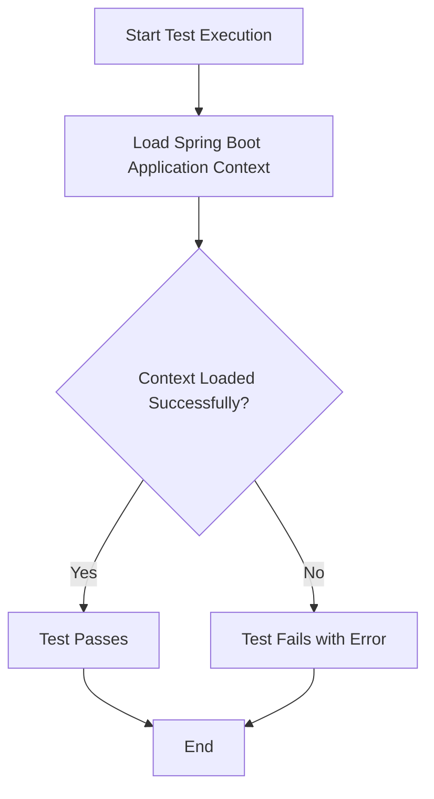

# DemoApplicationTests

## Overview

This file contains the integration test class for the **Postgres Multi-Tenancy** application. Its purpose is to verify that the Spring Boot application context loads successfully without errors, serving as a basic smoke test to ensure the application's configuration and dependency wiring are correct.

## Details

| Attribute         | Value                                      |
|-------------------|--------------------------------------------|
| **Package**       | `br.com.fullcustom.postgresmultitenancy`   |
| **Class Name**    | `DemoApplicationTests`                     |
| **Framework**     | Spring Boot Test (JUnit 5)                 |
| **Test Type**     | Integration / Smoke Test                   |

## Test Cases

| Test Method     | Description                                                                                          |
|-----------------|------------------------------------------------------------------------------------------------------|
| `contextLoads`  | Validates that the entire Spring Boot application context initializes successfully without failures.  |

## Process Flow

## Insights

- This is a standard auto-generated test class provided by Spring Boot when a new project is scaffolded. It acts as a foundational health check for the application.
- The `@SpringBootTest` annotation triggers the loading of the full application context, which includes all beans, configurations, and multi-tenancy setup specific to the Postgres multi-tenancy architecture.
- A failure in this test typically indicates issues with bean definitions, missing configurations, database connectivity problems, or incompatible dependencies — all of which are critical for a multi-tenant system to function properly.
- As the application evolves, this test class should be extended with additional test cases covering tenant resolution, data isolation, and other multi-tenancy-specific behaviors.
